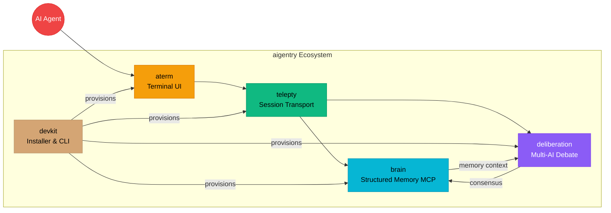

<div align="center">

# aigentry

**One command installs the entire aigentry ecosystem** — terminal, cross-session transport, persistent memory, and multi-AI deliberation for AI agents.

[](https://www.npmjs.com/package/@dmsdc-ai/aigentry)
[](LICENSE)

</div>

---

## Install

One command installs the entire ecosystem:

```bash
npm i -g @dmsdc-ai/aigentry
```

## Ecosystem

| Module | Package | Description |
|--------|---------|-------------|
| **aterm** | `@dmsdc-ai/aterm` | Terminal UI for AI agents |
| **telepty** | `@dmsdc-ai/aigentry-telepty` | Session transport + inter-session communication |
| **devkit** | `@dmsdc-ai/aigentry-devkit` | Installer, orchestrator, and CLI tooling |
| **brain** | `@dmsdc-ai/aigentry-brain` | Persistent structured memory (MCP server) |
| **deliberation** | `@dmsdc-ai/aigentry-deliberation` | Multi-AI structured debate (MCP server) |

## Usage

```bash
# Check ecosystem status
aigentry status

# Show version
aigentry version

# Show help
aigentry help
```

## Architecture



## What this is

aigentry is a meta-package. `npm i -g @dmsdc-ai/aigentry` installs and version-checks the whole stack — [aterm](https://github.com/dmsdc-ai/aterm), [telepty](https://github.com/dmsdc-ai/aigentry-telepty), [devkit](https://github.com/dmsdc-ai/aigentry-devkit), [brain](https://github.com/dmsdc-ai/aigentry-brain), and [deliberation](https://github.com/dmsdc-ai/aigentry-deliberation) — behind one CLI. Each module is independently useful and separately published; this package just wires them together and reports status via `aigentry status`.

- **Remember** — persistent structured memory across sessions (brain)
- **Deliberate** — multi-model debate before deciding (deliberation)
- **Connect** — cross-session, cross-machine transport (telepty)

## Brand Assets

Logos, mascot, color palette, and social media assets are in [`/brand`](./brand/).

## Contributing

See [CONTRIBUTING.md](CONTRIBUTING.md) for guidelines.

## License

MIT - See [LICENSE](LICENSE) for details.
