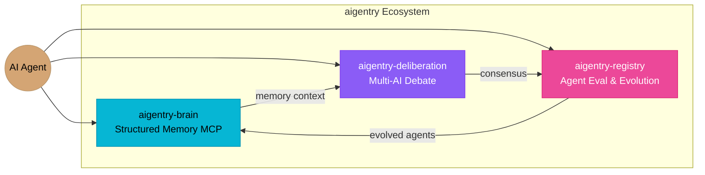

<div align="center">

# aigentry

**Sovereign Brain OS for AI Agents**

The open ecosystem where AI agents evolve, deliberate, and remember.

[](LICENSE)
[](https://github.com/aigentry/aigentry-brain)
[](https://github.com/aigentry/aigentry-deliberation)
[](https://github.com/aigentry/aigentry-registry)

</div>

---

## Architecture



## Ecosystem

| Project | Description | Status |
|---------|-------------|--------|
| [aigentry-brain](https://github.com/aigentry/aigentry-brain) | Structured memory MCP server. Persistent, queryable memory for AI agents. | Active |
| [aigentry-deliberation](https://github.com/aigentry/aigentry-deliberation) | Multi-AI deliberation framework. Structured debates between Claude, Codex, Gemini, and more. | Active |
| [aigentry-registry](https://github.com/aigentry/aigentry-registry) | Agent evaluation and evolution platform. Track, compare, and evolve AI agents. | Active |

## Vision

aigentry is building the infrastructure layer for autonomous AI agents:

- **Remember** — Structured, persistent memory that survives across sessions
- **Deliberate** — Multi-model debates that surface better decisions
- **Evolve** — Continuous evaluation and improvement of agent capabilities

The goal: AI agents that are not disposable prompt-followers, but sovereign entities with memory, judgment, and growth.

## Quick Start

```bash
# Install aigentry-brain (MCP server)
npx aigentry-brain

# Start a multi-AI deliberation
npx aigentry-deliberation start --topic "System design review"

# Launch the registry
cd aigentry-registry && npm run dev
```

## Brand Assets

Logos, mascot, color palette, and social media assets are in [`/brand`](./brand/).

## Contributing

See [CONTRIBUTING.md](CONTRIBUTING.md) for guidelines.

## License

MIT - See [LICENSE](LICENSE) for details.
